# Underwater Marine Species Detection with YOLOv8

Real-time object detection of 7 marine animal classes in aquarium footage, built by fine-tuning a COCO-pretrained **YOLOv8n** on the Aquarium dataset.

**Classes:** fish · jellyfish · penguin · puffin · shark · starfish · stingray

<p align="center">
  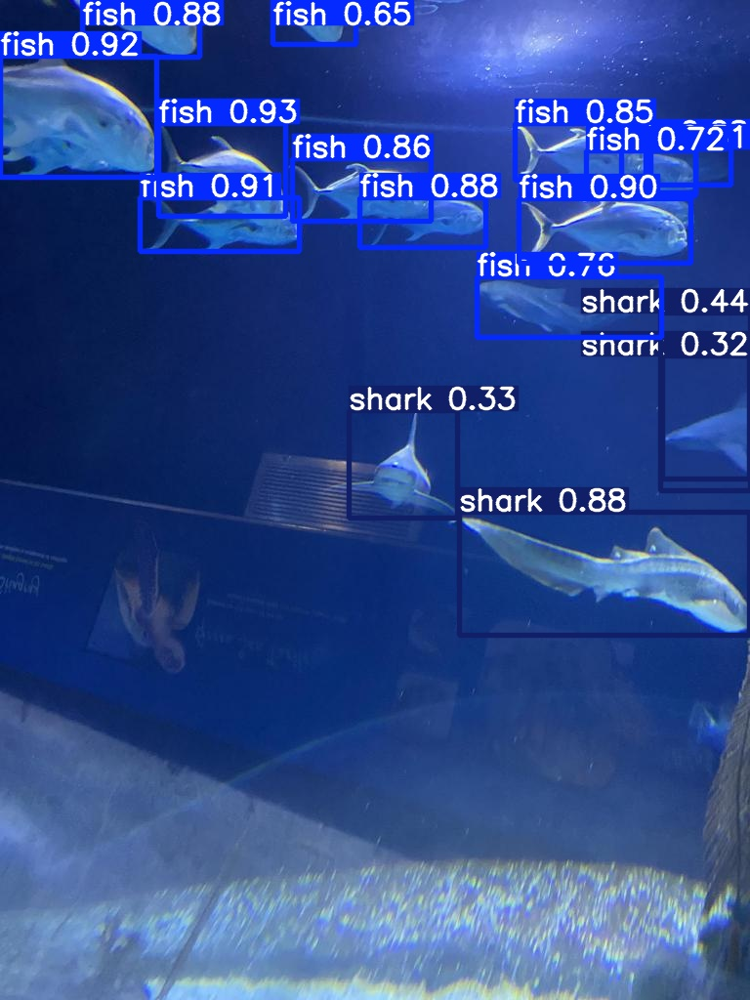
  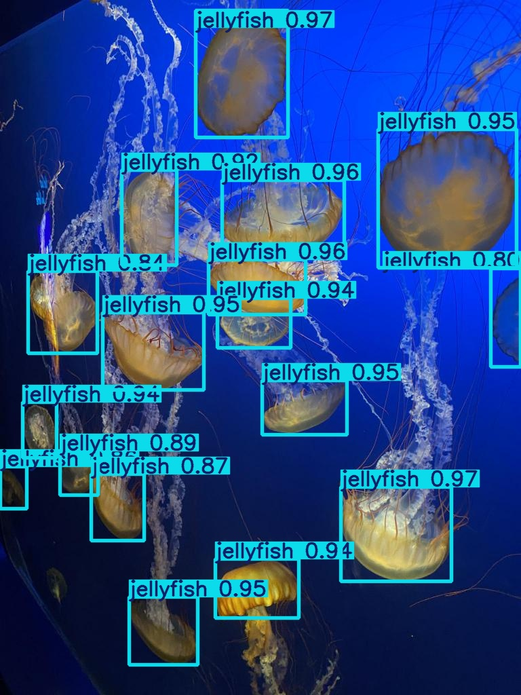
  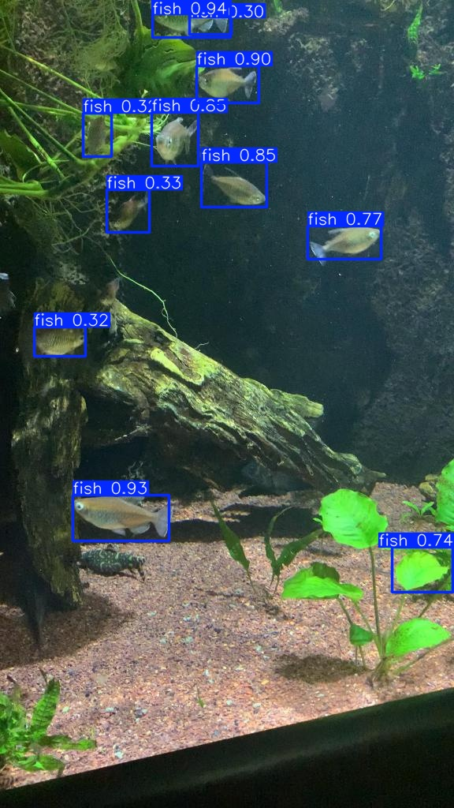
</p>

---

## Results at a Glance

| Split | Images | Objects | Precision | Recall | mAP@0.50 | mAP@0.50:0.95 |
|---|---|---|---|---|---|---|
| Validation (`best.pt`) | 127 | 909 | 0.790 | 0.694 | **0.757** | **0.461** |
| Test (held-out, conf = 0.5) | 63 | 584 | 0.863 | 0.642 | 0.619 | 0.404 |

Test mAP@0.75 is **0.467**.

| Model | Parameters | GFLOPs | Weights size | Inference speed (Tesla T4) | Training time |
|---|---|---|---|---|---|
| YOLOv8n | 3.0 M | 8.1 | 6.2 MB | ~17 ms / image | ~8 min (100 epochs) |

---

## Dataset

[Aquarium Dataset (COTS)](https://www.kaggle.com/datasets/slavkoprytula/aquarium-data-cots) on Kaggle (CC BY-SA 4.0). It contains 638 images taken at two aquariums in the US, annotated in YOLO format.

| Class | Train | Valid | Test |
|---|---|---|---|
| fish | 1961 | 459 | 249 |
| jellyfish | 385 | 155 | 154 |
| penguin | 330 | 104 | 82 |
| puffin | 175 | 74 | 35 |
| shark | 259 | 57 | 38 |
| starfish | 78 | 27 | 11 |
| stingray | 136 | 33 | 15 |
| **Images** | **448** | **127** | **63** |

The dataset is **heavily imbalanced**: there are about 25× more `fish` than `starfish` in the training set. Most boxes are also **small**: the typical box covers less than 10% of the image width and height (see `labels.jpg`).

<p align="center">
  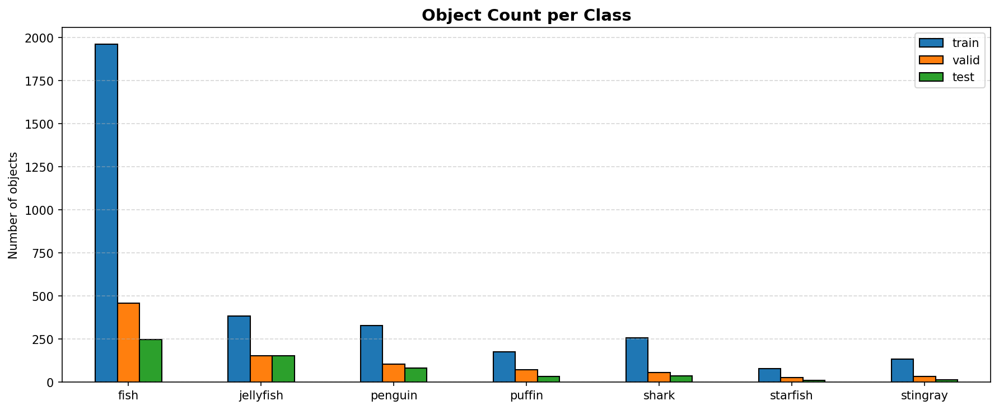
</p>

---

## Approach

1. **Data exploration.** Counted objects per class in each split and plotted ground-truth boxes on random training images to check the annotations.
2. **Dataset config.** Wrote `data.yml` with the dataset root and the 7 class names.
3. **Transfer learning.** Fine-tuned `yolov8n.pt` (COCO-pretrained, 319/355 weight tensors transferred) with the settings below.

   | Setting | Value |
   |---|---|
   | Epochs | 100 |
   | Image size | 640 |
   | Batch size | 16 |
   | Optimizer | AdamW |
   | Initial LR | 5e-4 |
   | Weight decay | 0.01 |
   | Augmentation | Mosaic (turned off for the last 10 epochs), HSV jitter, horizontal flip, scale/translate, plus light Blur, MedianBlur, CLAHE and ToGray from Albumentations |
   | Mixed precision | AMP enabled |
   | Hardware | Kaggle Tesla T4 |

4. **Evaluation.** Validated `best.pt` on the validation split. Then evaluated it on the held-out test split, reporting mAP@0.50, mAP@0.75 and mAP@0.50:0.95 plus per-class precision, recall and F1.
5. **Hyperparameter search.** Ran the Ultralytics genetic-evolution tuner for 10 iterations × 30 epochs (~28 min on GPU). An earlier Ray Tune attempt failed, because the trials could not see the dataset config or the GPU.
6. **Export.** Packaged the weights, metrics, plots and sample predictions for this repo.

---

## Training Curves

Training losses fall steadily over all 100 epochs. Validation mAP@0.50 plateaus at around 0.75–0.77 from about epoch 70, while validation box loss flattens out. That pattern suggests the small dataset, not the number of epochs, is what limits accuracy.

<p align="center">
  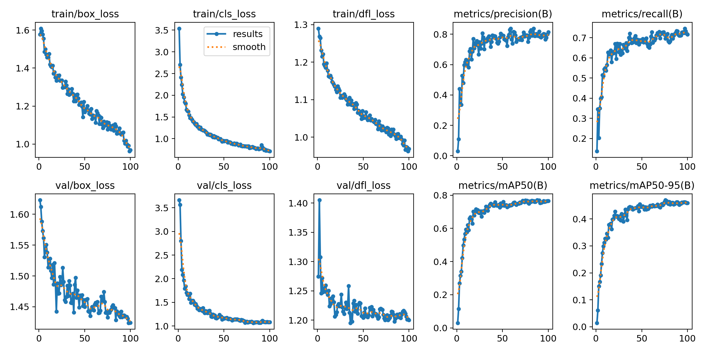
</p>

---

## Per-Class Performance (Test Set)

| Class | Precision | Recall | F1 | mAP@0.50 | mAP@0.50:0.95 |
|---|---|---|---|---|---|
| fish | 0.804 | 0.643 | 0.714 | 0.594 | 0.352 |
| jellyfish | 0.866 | 0.799 | **0.831** | 0.779 | 0.516 |
| penguin | 0.857 | 0.512 | 0.641 | 0.488 | 0.219 |
| puffin | 0.737 | 0.400 | 0.519 | 0.365 | 0.194 |
| shark | 0.962 | 0.658 | 0.781 | 0.654 | 0.445 |
| starfish | 0.818 | 0.818 | 0.818 | **0.788** | **0.587** |
| stingray | 1.000 | 0.667 | 0.800 | 0.665 | 0.515 |
| **Mean** | **0.863** | **0.642** | **0.729** | **0.619** | **0.404** |

<p align="center">
  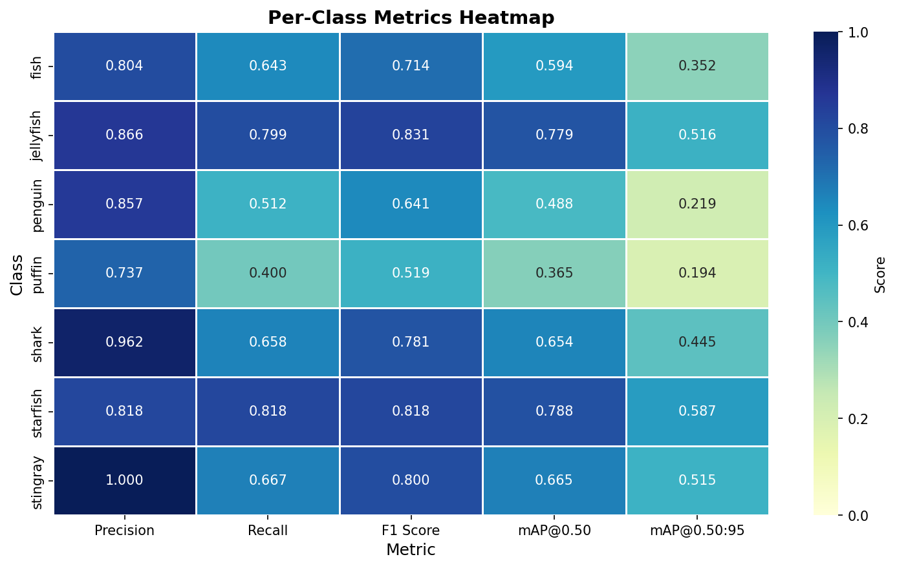
</p>

<p align="center">
  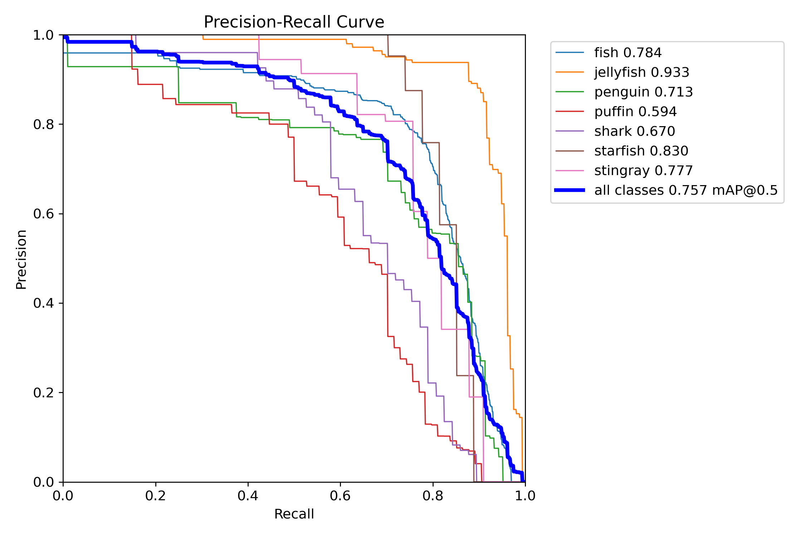
  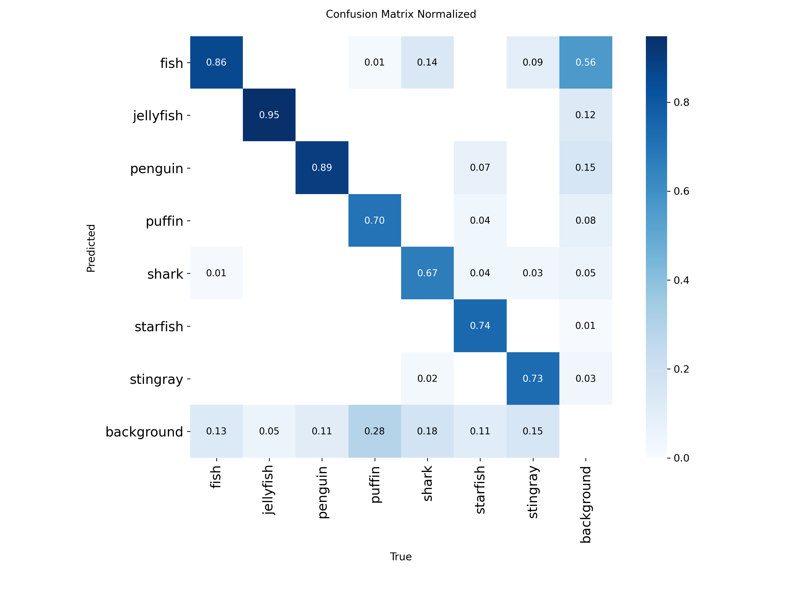
</p>

---

## Error Analysis

- **High precision, lower recall.** Mean precision is 0.86 but mean recall is 0.64. When the model makes a prediction it is usually right, but it misses objects, mostly small or partly hidden ones.
- **Puffin is the weakest class** (mAP@0.50 = 0.37). About 28% of puffins are missed and counted as background. They are small, dark, and often shot against dark rock.
- **Penguin recall is low** (0.51). Penguins often appear in dense groups, partly underwater, so their boxes overlap.
- **Shark is sometimes predicted as fish** (14% of true sharks), since the two look alike in side profile.
- **Background false positives are mostly `fish`.** Many of these appear to be real fish in the background that were never annotated, so the measured precision is probably a little lower than the true precision.
- **Performance tracks box quality, not class frequency.** Starfish has only 78 training examples yet scores the best mAP@0.50:0.95 (0.59), because starfish are large, still and high-contrast. Fish is the largest class, but it scores lower because its boxes are small and crowded.

---

## Sample Predictions

<p align="center">
  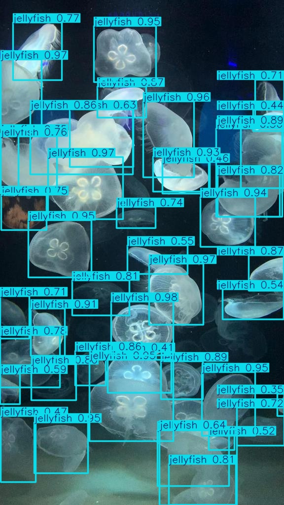
  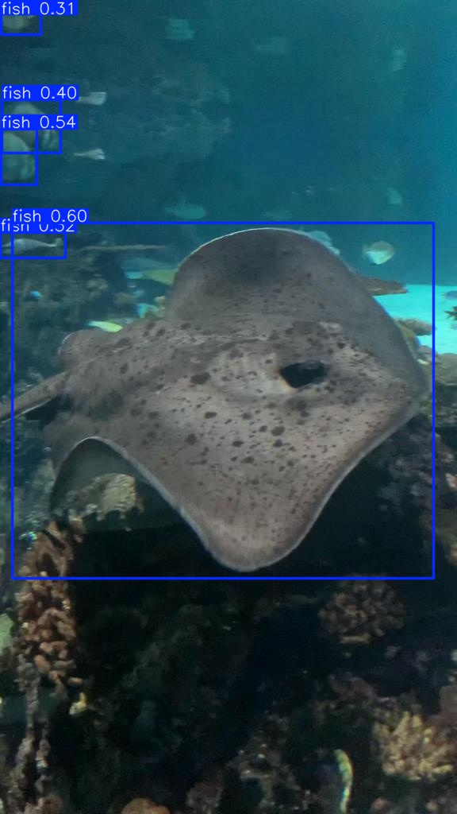
  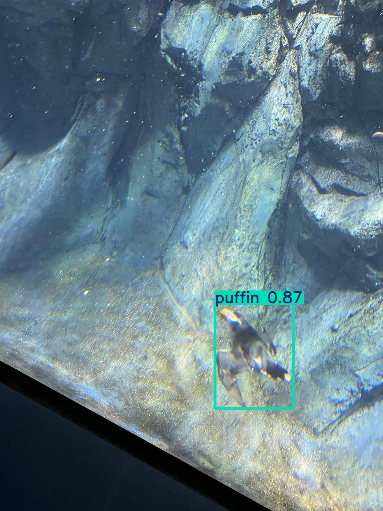
  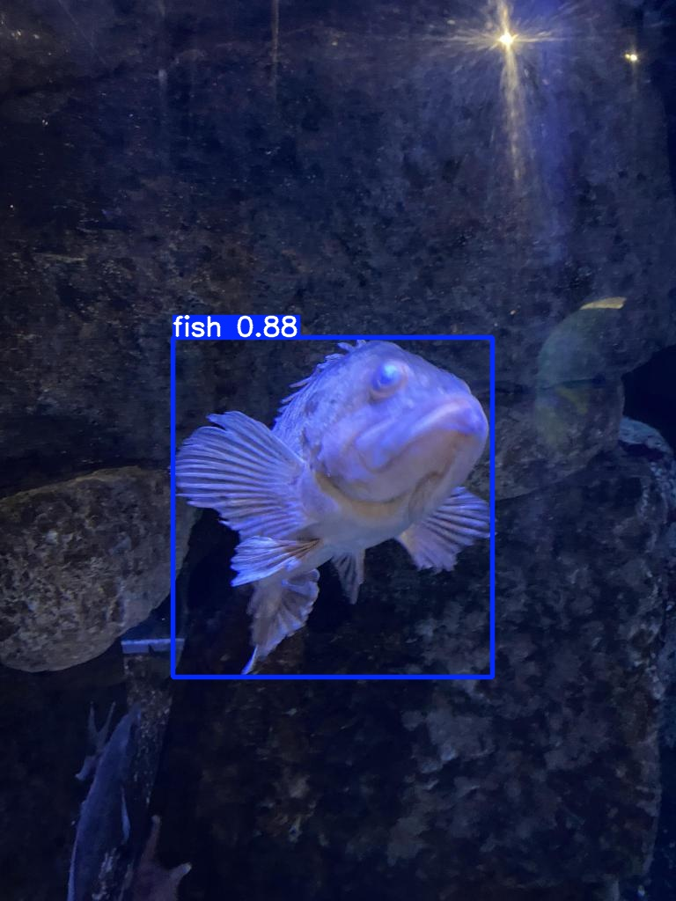
</p>

The second image shows a failure case: a stingray is labelled `fish`, and a fish box has been drawn around the whole stingray.

---

## Hyperparameter Tuning

The genetic-evolution tuner ran 10 iterations of 30 epochs each. Its best fitness (validation mAP@0.50:0.95 = **0.323**) came at iteration 1, which uses the default hyperparameters (`best_hyperparameters.yaml`). None of the mutated settings did better within 30 epochs. All of them scored below the 100-epoch baseline (0.461), so **the baseline model is the one shipped here**. With a dataset this small, a longer training budget per trial or a larger model would probably help more than tuning.

---

## Repository Structure

```
├── underwater-marine-species-detection-using-yolov8.ipynb   # full pipeline (Kaggle)
├── data.yml                     # YOLO dataset config
├── best_hyperparameters.yaml    # tuner output
├── results.csv                  # per-epoch training metrics
├── weights/
│   ├── best.pt                  # best checkpoint (by validation fitness)
│   └── last.pt                  # final epoch
├── training_plots/              # loss curves, PR/F1/P/R curves, confusion matrices, custom metric plots
└── inference_samples/           # predictions on test images
```

---

## Quick Start

```bash
pip install ultralytics
```

```python
from ultralytics import YOLO

model = YOLO("weights/best.pt")
results = model.predict("path/to/image.jpg", conf=0.25, save=True)

for box in results[0].boxes:
    print(model.names[int(box.cls)], float(box.conf), box.xyxy.tolist())
```

To reproduce training on Kaggle:

1. Open the notebook on Kaggle and set **Accelerator → GPU T4** and **Internet → On**.
2. Add the dataset `slavkoprytula/aquarium-data-cots` as an input. If you skip this, the notebook downloads it with `kagglehub`.
3. Run all cells. Set `RUN_TUNING = False` to skip the ~28-minute tuning step.

---

## Limitations and Next Steps

- **Test mAP was computed at `conf=0.5`.** A high confidence threshold cuts off the low-confidence end of the precision-recall curve, so AP is underestimated. Re-evaluating at the Ultralytics default (`conf=0.001`) would give a figure comparable to the validation mAP.
- **The test set is small** (63 images, only 11 starfish and 15 stingrays), so per-class test scores for rare classes carry high variance.
- Planned improvements:
  - Train at a higher resolution (`imgsz=960/1280`) or with SAHI tiling to catch small fish and puffins.
  - Try a larger backbone (YOLOv8s/m).
  - Use class-balanced sampling or copy-paste augmentation for the rare classes.
  - Clean up the missing `fish` annotations.
  - Export to ONNX/TensorRT for edge deployment.

---

## Tech Stack

Python · PyTorch · Ultralytics YOLOv8 · OpenCV · NumPy · Pandas · Matplotlib · Seaborn · Kaggle (Tesla T4 GPU)

## Acknowledgements

- Dataset: [Aquarium Dataset (COTS)](https://www.kaggle.com/datasets/slavkoprytula/aquarium-data-cots), originally from Roboflow, CC BY-SA 4.0
- [Ultralytics YOLOv8](https://github.com/ultralytics/ultralytics)

## Author

**Vaibhav Kumar**, B.Tech, IIT Guwahati
